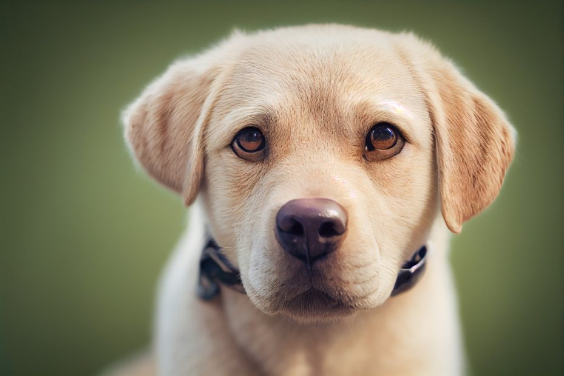
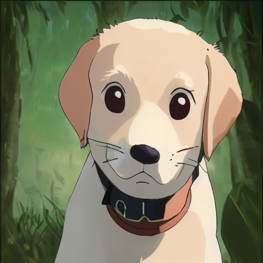

# lora-style-transfer-pipeline

A reproducible workflow for controllable image style transfer using Stable Diffusion, LoRA fine-tuning, and structure-preserving preprocessing tools such as Canny Edge Detection and OpenPose.

This project explores how to build a stable and reusable style transfer workflow that preserves structural consistency while applying stylized visual transformations.

## Features

- LoRA fine-tuning workflow
- Dataset preprocessing and label refinement
- Structure-preserving style transfer
- Canny Edge Detection integration
- OpenPose-assisted generation
- txt2img and img2img support
- Reproducible generation pipeline

## Workflow

Dataset Preparation
↓
LoRA Training (Kohya_ss)
↓
Structure Extraction (Canny / OpenPose)
↓
Stable Diffusion Generation
↓
Result Evaluation

## Example Results
| Input | Stylized Output |
|---|---|
|  |  |

## Tech Stack

- Python
- Stable Diffusion
- LoRA
- Kohya_ss
- OpenCV
- ControlNet
- OpenPose
- PyTorch

## Project Goals

This project focuses on:

- improving style consistency
- preserving structural features
- building reusable generation workflows
- exploring controllable style transfer pipelines

## Future Work

- Extend workflow to multiple art styles
- Improve structure consistency
- Explore automated prompt generation
- Integrate semantic-aware preprocessing
- Build interactive user interface

## References

- Stable Diffusion
- Kohya_ss
- OpenPose
- ControlNet
