# lora-style-transfer-pipeline

An individual research project focused on controllable image style transfer using Stable Diffusion and LoRA fine-tuning.

The project investigates how structure-preserving techniques, including Canny Edge Detection, OpenPose, and image preprocessing methods, can improve style transfer quality while maintaining subject characteristics.

A human-centered evaluation framework was also developed to assess style fidelity and feature preservation.

## Features

- LoRA fine-tuning workflow
- Dataset preprocessing and label refinement
- Structure-preserving style transfer
- Canny Edge Detection integration
- OpenPose-assisted generation
- txt2img and img2img support
- Reproducible generation pipeline

## Workflow

### 1. Dataset Preparation

- Image collection
- Dataset filtering
- Caption generation
- Label refinement
- Dataset balancing

### 2. LoRA Training

- Stable Diffusion base model
- Kohya_ss training workflow
- Parameter tuning
- Style consistency evaluation

### 3. Structure-Preserving Guidance

- Gaussian Blur preprocessing
- Canny Edge Detection
- OpenPose conditioning
- ControlNet integration

### 4. Image Generation

- txt2img generation
- img2img generation
- Controlled style transfer

### 5. Evaluation

- Style fidelity assessment
- Feature preservation assessment
- Human evaluation study

## Pipeline Example

| Original Image | Canny Edge Map | Generated Result |
|---|---|---|
| 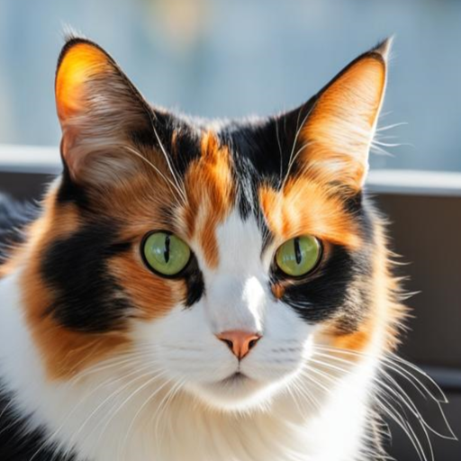 | 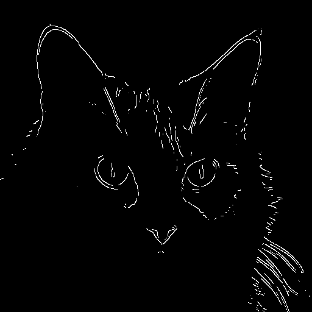 | 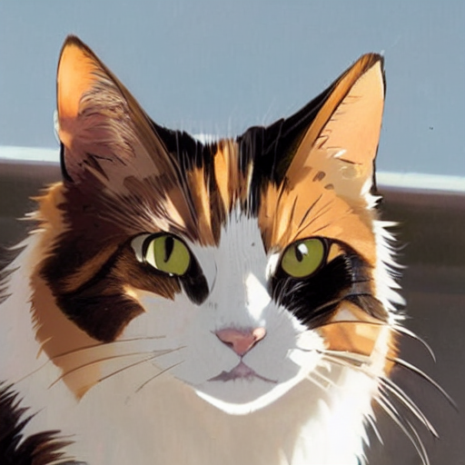 |

Gaussian Blur preprocessing was applied before edge extraction to reduce noise and improve structural guidance during generation.

## Example Results
| Input | Stylized Output |
|---|---|
| 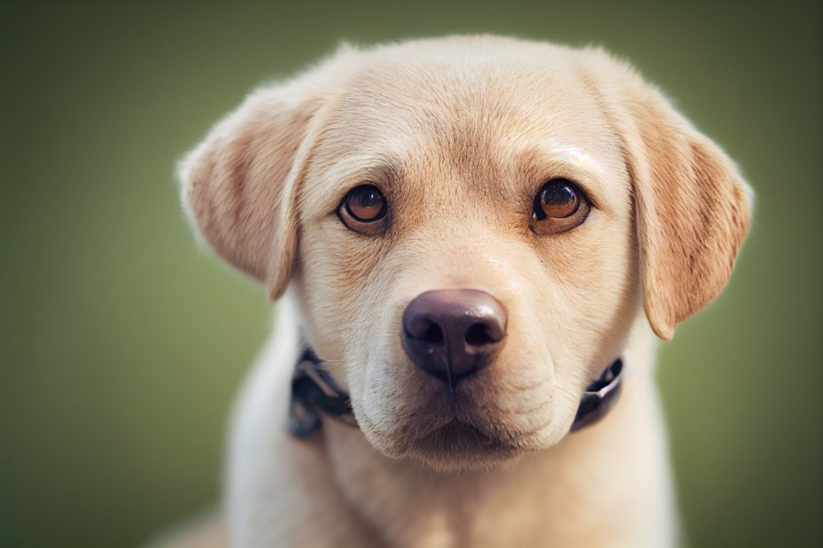 | 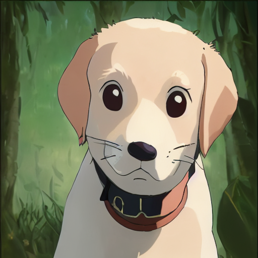 |
| 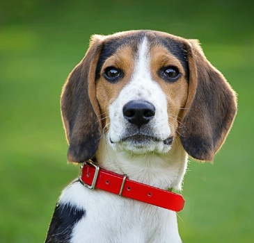 | 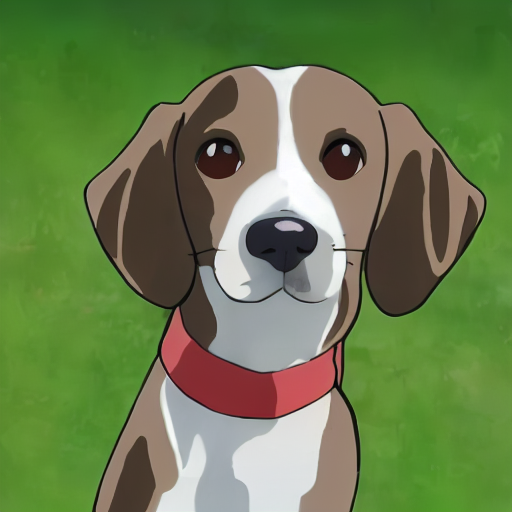 |
| 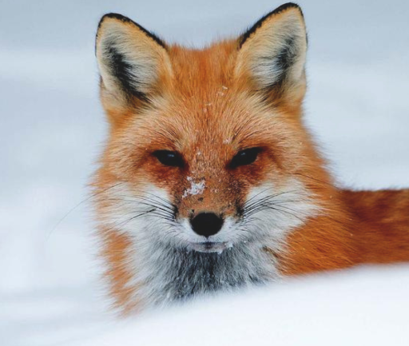 | 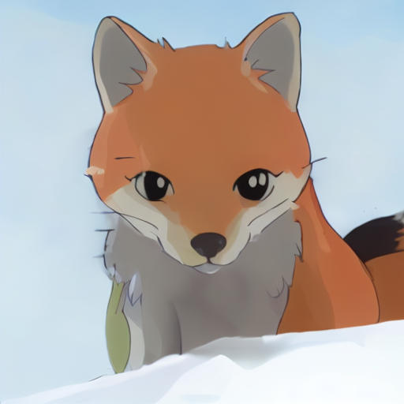 |
| 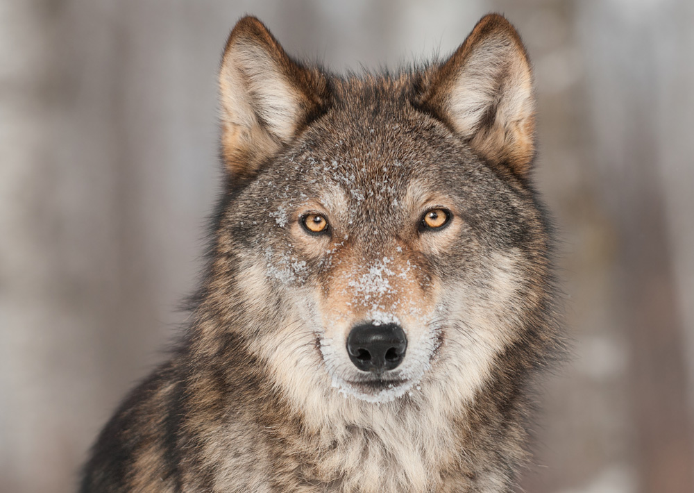 | 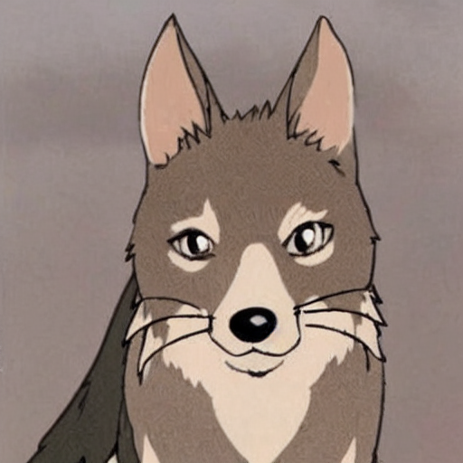 |

## Evaluation Methodology

A structured user study was conducted to evaluate generation quality.

Evaluation dimensions included:

- Style Fidelity
- Feature Preservation
- Structural Consistency
- Overall Visual Quality

A total of 35 responses were collected.

After style-recognition screening, 26 valid responses were retained for analysis.

## Tech Stack

- Stable Diffusion
- LoRA
- Kohya_ss
- ControlNet
- OpenPose
- Canny Edge Detection
- OpenCV
- Python

## Project Highlights

- Built a custom dataset containing 125 images.
- Designed an end-to-end LoRA training and evaluation workflow.
- Integrated ControlNet-based structure preservation methods.
- Developed a human-centered evaluation framework.
- Collected 35 questionnaire responses and analyzed 26 valid samples.

## Future Work

- Extend workflow to multiple art styles
- Improve structure consistency
- Explore automated prompt generation
- Integrate semantic-aware preprocessing
- Build interactive user interface

## References

- Stable Diffusion
- Kohya_ss
- OpenPose
- ControlNet
